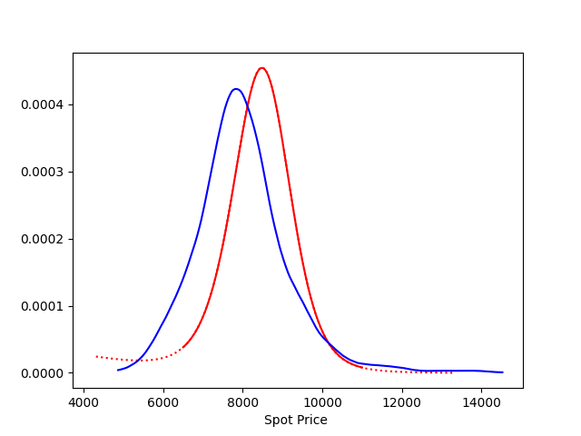

[](http://quantlet.de/)

## [](http://quantlet.de/) **CrypOpt_RNDandHD** [](http://quantlet.de/)

```yaml

Name of Quantlet: 'CrypOpt_RNDandHD'

Published in: 'DEDA_class_2020SS/DEDA_2020SS_Crypto_Options_RND_HD'

Description: 'Compares the risk neutral density and the historical density of bitcoin prices. For more detailed description of estimation methods of densities see Quantlets CrypOpt_RiskNeutralDensity and CrypOpt_HistoricalDensity.'

Keywords: 'crypto options, cryptocurrency, historical density, physical density, risk neutral density, state price density, Rookley, pricing kernel'

Author: 'Franziska Wehrmann'

See also: 'CrypOpt_HistoricalDensity, CrypOpt_RiskNeutralDensity'

Submitted:  '08. Aug 2020, Franziska Wehrmann'

Datafile: 'BTCUSDT.csv: Daily BTCUSDT price 2017-08-17 to 2020-04-30. trades_clean.csv: Clean version of Deribit options trades, we are only interested in WHICH option were traded, not how often (delete duplicates).'

```



### PYTHON Code
```python

import os
import pandas as pd
import numpy as np

from matplotlib import pyplot as plt
from matplotlib.pyplot import cm

from smoothing import locpoly_smoothing, bspline
from risk_neutral_density import rnd_appfinance
from expand import expand_X
from historical_density import sampling, density_estimation

cwd =  os.path.join(os.getcwd(), 'DEDA_2020SS_Crypto_Options_RND_HD',
                    'CrypOpt_RNDandHD')
data_path = os.path.join(cwd, 'data') + '/'

# ------------------------------------------------------------------------ MAIN

# ---------------------------------------------------------- LOAD DATA ---- RND
d = pd.read_csv(data_path + 'trades_clean.csv')
d = d.drop('Unnamed: 0', axis=1)
d = d.drop_duplicates()
print('exclude values with too big or too small Moneyness : ',
      sum(d.M > 1.3) + sum(d.M <= 0.7))
d = d[d.M <= 1.2]  # filter out Moneyness bigger than 1.3
d = d[d.M > 0.7]   # filter out Moneyness small than 0.7

print(d.date.value_counts())
day = '2020-03-11'
df = d[(d.date == day)]
print(df.tau_day.value_counts())
res = dict()
num = 140
tau_day = 2

# ---------------------------------------------------------------- LOAD DATA HD
d_usd = pd.read_csv(data_path + 'BTCUSDT.csv')
target = 'Adj.Close'
n = 10000
h_hd = 0.11
S0 = d_usd.loc[d_usd.Date == day, target].iloc[0]

# --------------------------------------------------------------------- 3D PLOT
fig1 = plt.figure(figsize=(7, 5))
ax1 = fig1.add_subplot(111, projection='3d')
taus = [1, 2, 9, 16, 44, 107, 198]
color=cm.rainbow(np.linspace(0,1,len(taus)))

for tau_day, c, i in zip(taus, color, range(1, len(taus)+1)):
    print(tau_day)
    df_tau = d[(d.tau_day == tau_day) & (d.date == day)]
    df_tau['M_std'] = (df_tau.M - np.mean(df_tau.M)) / np.std(df_tau.M)
    h = df_tau.shape[0] ** (-1 / 9)
    tau = df_tau.tau.iloc[0]
    r = 0

    # -------------------------------------------------------------- SPD NORMAL
    spd = rnd_appfinance
    smoothing_method = locpoly_smoothing
    smile, first, second, M, S, K = smoothing_method(df_tau, tau, h, h_t=0.1,
                                                     gridsize=num, kernel='epak')
    y_3d = [i]*len(K)
    result = spd(M, S, K, smile, first, second, r, tau)
    ax1.plot(K[::-1],  y_3d, result, c=c)


    # ---------------------------------------------------------------- B-SPLINE
    M_long, M_left, M_right = expand_X(M, add_left=70, add_right=70)
    S_long, S_left, S_right = expand_X(S, add_left=70, add_right=70)
    K_long, K_left, K_right = expand_X(K, add_left=70, add_right=70)
    y_3d_long = [i] * len(K_long)

    pars, spline, points = bspline(M, smile, sections=8, degree=3)

    # derivatives
    first_fct = spline.derivative(1)
    second_fct = spline.derivative(2)

    smile_long = spline(M_long)
    first_long = first_fct(M_long)
    second_long = second_fct(M_long)

    result_long = spd(M_long, S_long, K_long,
                      smile_long, first_long, second_long,
                      r, tau)
    ax1.plot(K_long[::-1], y_3d_long, result_long, ':', c=c)

    # ---------------------------------------------------------------------- HD
    sample_MC = sampling(d_usd, target, tau_day, S0, n)
    sample = sample_MC
    S_hd = np.linspace(sample.min()*0.99, sample.max()*1.01, num=500)
    y_3d_hd = [i]*len(S_hd)
    hd = density_estimation(sample, S_hd, S0*h_hd, kernel='epanechnikov')
    ax1.plot(S_hd, y_3d_hd, hd, '-', c=c)


# --------------------------------------------------------------------- 2D PLOT
def plot_2d(d, day, tau_day):
    df_tau = d[(d.tau_day == tau_day) & (d.date == day)]
    df_tau['M_std'] = (df_tau.M - np.mean(df_tau.M)) / np.std(df_tau.M)
    h = df_tau.shape[0] ** (-1 / 9)
    tau = df_tau.tau.iloc[0]
    r = 0

    fig1 = plt.figure()
    ax1 = fig1.add_subplot(111)

    # -------------------------------------------------------------- SPD NORMAL
    spd = rnd_appfinance
    smoothing_method = locpoly_smoothing
    smile, first, second, M, S, K = smoothing_method(df_tau, tau, h, h_t=0.1,
                                                 gridsize=num, kernel='epak')
    result = spd(M, S, K, smile, first, second, r, tau)
    ax1.plot(K[::-1], result, c='r')


    # ------------------------------------------------------ EXTENSION B-SPLINE
    M_long, M_left, M_right = expand_X(M, add_left=70, add_right=70)
    S_long, S_left, S_right = expand_X(S, add_left=70, add_right=70)
    K_long, K_left, K_right = expand_X(K, add_left=70, add_right=70)

    pars, spline, points = bspline(M, smile, sections=8, degree=3)

    # derivatives
    first_fct = spline.derivative(1)
    second_fct = spline.derivative(2)

    smile_long = spline(M_long)
    first_long = first_fct(M_long)
    second_long = second_fct(M_long)

    result_long = spd(M_long, S_long, K_long, smile_long, first_long,
                      second_long, r, tau)
    ax1.plot(K_long[::-1], result_long, ':', c='r')

    # ---------------------------------------------------------------------- HD
    sample = sampling(d_usd, target, tau_day, S0, n)
    S_hd = np.linspace(sample.min()*0.99, sample.max()*1.01, num=500)
    hd = density_estimation(sample, S_hd, S0*h_hd, kernel='epanechnikov')
    ax1.plot(S_hd, hd, '-', c='b')

    ax1.set_xlabel('Spot Price ')
    return fig1

tau_day = 9
fig2 = plot_2d(d, day, tau_day)  # red: RND, blue: HD
fig2.savefig(os.path.join(cwd, '{}_RNDandHD_T{}.png'.format(day, tau_day)),
             transparent=True)
```

automatically created on 2020-08-12