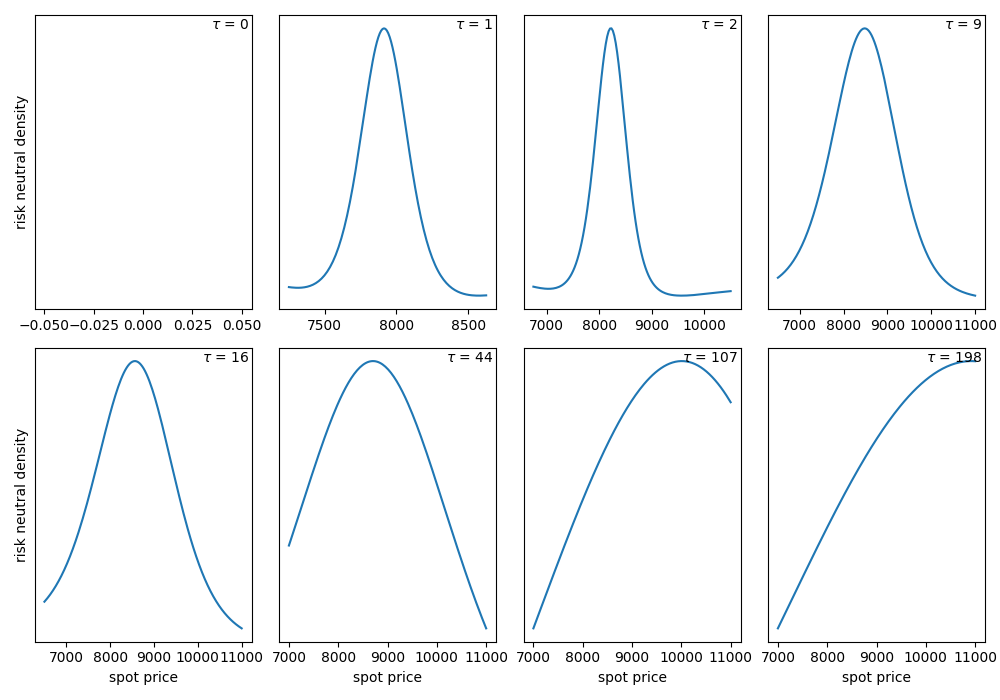
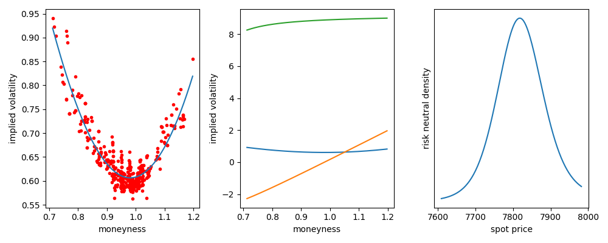
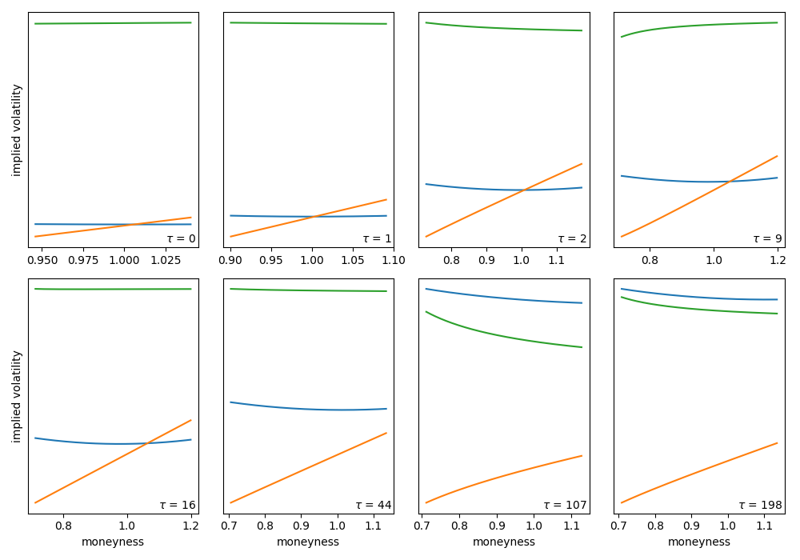
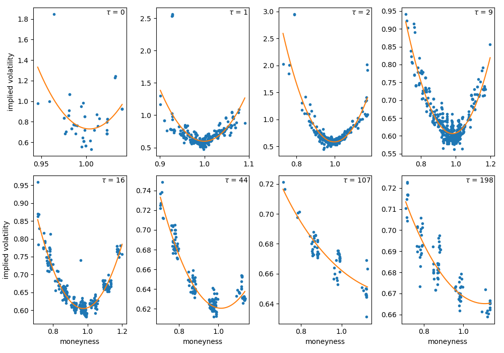

[](http://quantlet.de/)

## [](http://quantlet.de/) **CrypOpt_RiskNeutralDensity** [](http://quantlet.de/)

```yaml

Name of Quantlet: 'CrypOpt_RiskNeutralDensity'

Published in: 'DEDA_class_2020SS/DEDA_2020SS_Crypto_Options_RND_HD'

Description: 'Uses Rookley Method to estimate risk neutral density. Based on data of crypto options traded on Deribit.'

Keywords: 'Rookley, crypto options, cryptocurrency, risk neutral density, state price density, local polynomial, locpoly'

Author: 'Franziska Wehrmann'

See also: 'CrypOpt_RNDandHD'

Submitted:  '08. Aug 2020, Franziska Wehrmann'

Datafile: 'trades_clean.csv: Clean version of Deribit options trades, we are only interested in WHICH option were traded, not how often (delete duplicates).'

```









### PYTHON Code
```python

import os
import pandas as pd
import pickle
import numpy as np

from smoothing import locpoly_smoothing
from risk_neutral_density import rnd_appfinance

cwd =  os.path.join(os.getcwd(), 'DEDA_2020SS_Crypto_Options_RND_HD',
                    'CrypOpt_RiskNeutralDensity')
data_path = os.path.join(cwd, 'data') + '/'

# ------------------------------------------------------------------------ MAIN

# ------------------------------------------------------------------- LOAD DATA
d = pd.read_csv(data_path + 'trades_clean.csv')
print('exclude values with too big or too smal Moneyness : ',
      sum(d.M > 1.3) +  sum(d.M <= 0.7))
d = d[d.M <= 1.2]  # filter out Moneyness bigger than 1.3
d = d[d.M > 0.7]   # filter out Moneyness small than 0.7

print(d.date.value_counts())
day = '2020-03-11'
df = d[(d.date == day)]
print(df.tau_day.value_counts())
res = dict()
num = 140


for tau_day in df.tau_day.value_counts().index:
    print(tau_day)
    df_tau = d[(d.tau_day == tau_day) & (d.date == day)]
    h = df_tau.shape[0] ** (-1 / 9)
    tau = df_tau.tau.iloc[0]
    df_tau['M_std'] = (df_tau.M - np.mean(df_tau.M)) / np.std(df_tau.M)

    # --------------------------------------------------------------- SMOOTHING
    smoothing_method = locpoly_smoothing
    smile, first, second, M, S, K = smoothing_method(df_tau, tau, h,
                                        h_t=0.1, gridsize=num, kernel='epak')

    # ----------------------------------------------------------- CALCULATE SPD
    r = df.r.iloc[0]
    tau = df_tau.tau.iloc[0]

    spd = rnd_appfinance
    result = spd(M, S, K, smile, first, second, r, tau)

    res.update({tau_day : {'df': df_tau[['M', 'iv', 'S', 'K']],
                'M': M,
                'smile': smile,
                'first': first,
                'second': second,
                'K': K,
                'q': result,
                'S': S
                }})

with open(data_path + 'results_{}.pkl'.format(day), 'wb') as f:
    pickle.dump(res, f)

# plotting in separate script

```

automatically created on 2020-08-12